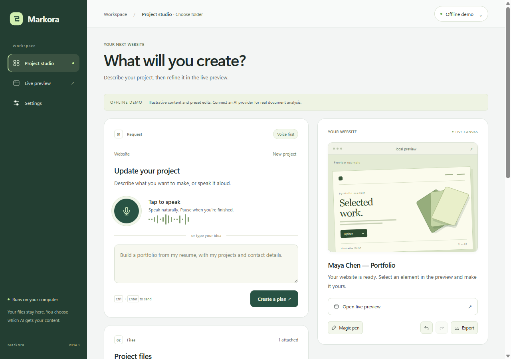
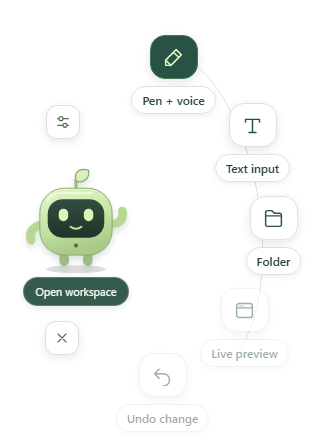
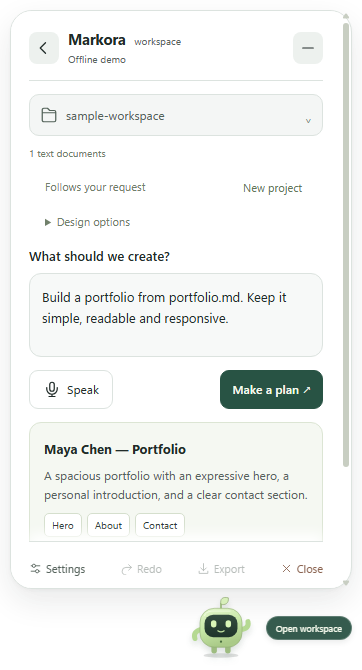
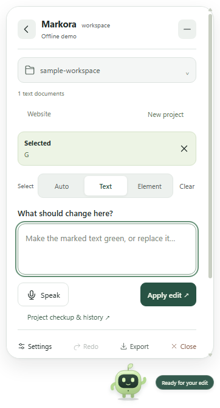
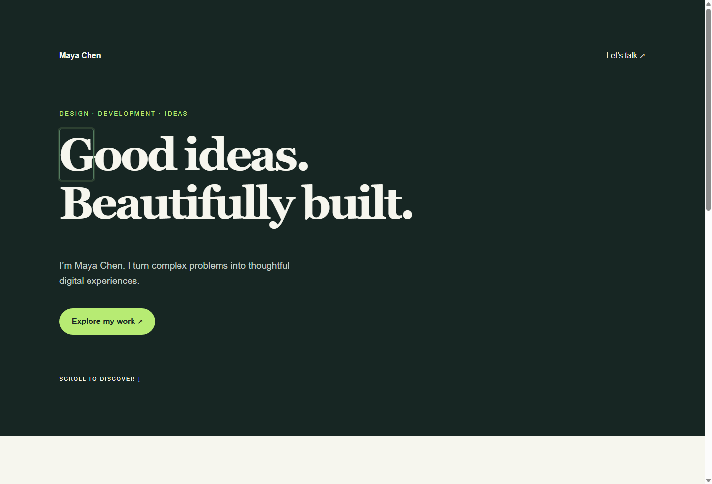
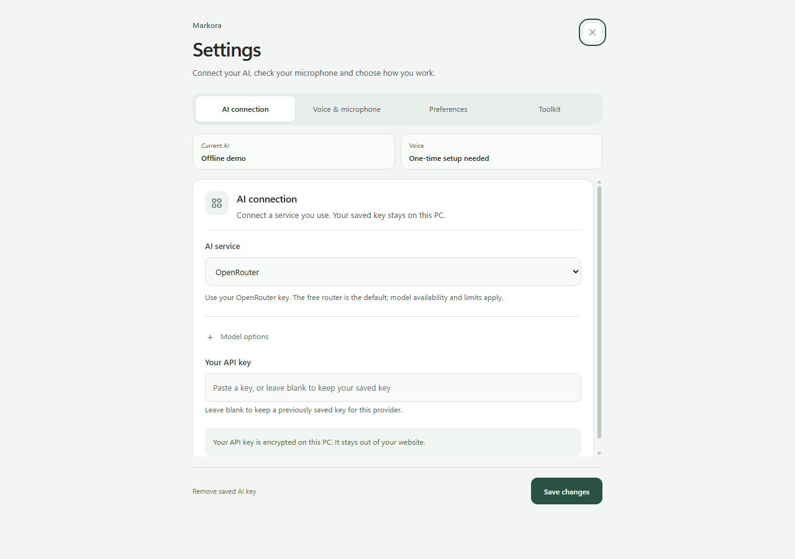
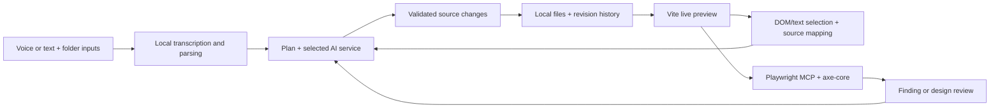

# Markora

Mark a detail. Say what should change.

Markora is a Windows desktop companion for building websites and editing local projects. Circle text or select an element in the live preview, then give a voice or text instruction. The app carries that selection, its source location and the surrounding layout into the edit request. Each saved change has undo and redo.

The idea came from a familiar interruption: taking a screenshot, opening a chat, explaining which button you meant, then copying the fix back into your project. Markora keeps that conversation beside the page.



Version 0.14.3 · Windows prototype · ForgeHacks Online 2026

## What you can do

- Build from a spoken or typed brief, with optional PDF, DOCX, Markdown, text or image inputs.
- Review the plan, watch the local preview update, then refine the result with the magic pen.
- Select static text down to a letter. Existing React/Vite projects use mapped source elements.
- Speak in Bengali or English; local multilingual recognition chooses its model internally. Recognized words can be corrected before applying an edit.
- Open an existing folder and work in that folder, with checked patches and saved revisions.
- Inspect source findings and run desktop/mobile browser checks using Playwright MCP and axe-core.
- Export website source, or use the same companion for bounded software and text-file projects.

New AI-generated websites use React and Vite by default. An explicit HTML request keeps the static HTML flow. Design preferences and custom component requests take priority over the bundled defaults.

## The companion

<table>
  <tr>
    <td align="center"></td>
    <td align="center"></td>
    <td align="center"></td>
  </tr>
  <tr>
    <td>Click the pet for tools. Drag its body to move it.</td>
    <td>Review the plan before writing files.</td>
    <td>Keep the marked detail attached to your next instruction.</td>
  </tr>
</table>



These are actual app screenshots using the fictional bundled sample and the built-in offline preset. They show the interface and selection workflow, rather than a live model's design quality.

## Run locally

You need a Windows PC and Node.js 22.12 or newer. Internet access is needed to install dependencies, download voice assets and use an AI service. The install step also downloads the Electron executable.

```sh
git clone https://github.com/asifahamed11/Markora.git
cd Markora
npm ci
npm start
```

The pet appears on the desktop. Click it, choose a folder and open Settings. Development launch does not register the Explorer menu; the Windows installer adds **Open with Markora**.

To open a folder directly:

```powershell
npm start -- --folder "C:\Projects\my-site"
```

For the larger project studio:

```sh
npm start -- --studio
```

### Connect your AI

| Service | Setup |
| --- | --- |
| ChatGPT account | Install the official [Codex CLI](https://developers.openai.com/codex/cli/). Connect in Settings, then use **Test model & use this account**. |
| Google account | Install the official [Antigravity CLI](https://www.antigravity.google/docs/cli/install/). Complete its sign-in and test the model in Settings. |
| OpenRouter | Add your own key in Settings. The default free router is subject to availability and provider limits. |

An account becomes active only after a successful model request. Subscription access, available models and quotas are determined by the provider. A browser sign-in alone does not prove that a model will work.

OpenRouter keys are encrypted with Electron's OS-backed secure storage. Account authentication stays with the official provider tool. Parsing, voice decoding, history and preview run locally; relevant prompts, document content and edit context are sent to the service you select.

In **Voice & microphone**, set up local voice once, choose your microphone and speak a sample. Model downloads are separate from the app. [Voice details and credits](docs/VOICE_MODELS.md).

<details>
<summary>Settings screenshot</summary>



</details>

## Try the demo

1. Create an empty workspace and copy [examples/portfolio.md](examples/portfolio.md) into it. The brief is fictional.
2. Connect a service and request: `Build a responsive portfolio from portfolio.md. Keep the facts accurate and give the work a clear visual identity.`
3. Review the plan and start the build. The preview stays open while sections appear.
4. Choose **Pen + voice**, mark a detail and say: `Make this green.` Use Text input if you prefer typing.
5. Undo the change, redo it, then open Project checkup or export the source.

Local color and size shortcuts can apply without a model call. More involved edits go to the selected AI service with the target context. Automatic transcription can still mishear a name or a mixed-language phrase; use the correction field when needed.

## How it works



The Electron main process owns file access, credentials and model transport. Renderers use a restricted preload bridge. Changes must match the expected source before they can be saved. Preview access is limited to the local project, and revision history supports recovery from unwanted edits. [Architecture](docs/ARCHITECTURE.md).

The [design toolkit](docs/DESIGN-TOOLKIT.md) supplies reviewed guidance, original presets and relevant React rules. New React builds use small local adaptations of shadcn/ui Button, ReUI Button and Magic UI BlurFade. These are three reviewed adaptations, with retained licenses, rather than the complete upstream libraries. [Component defaults](docs/COMPONENT-DEFAULTS.md).

## Build and package

```sh
npm run build
npm run verify:integrations
npm run package:win
```

The last command produces a Windows installer and portable executable under `release/v0.14.3/`. Voice assets are downloaded during setup. Installers are not included in this source repository.

The repository keeps the runtime source, pinned guidance, licensed assets, one sample brief and these screenshots. Dependencies, generated builds, account data, personal documents and local QA recordings are excluded.

## Current scope

Markora is a working prototype. It can generate source and inspect a local website; it does not automatically execute arbitrary generated software, provision backends or deploy a project. Browser checks cover the loaded page at desktop and mobile sizes, with keyboard and interaction checks still needing manual review. Chrome or Edge is required for the browser-check harness.

Existing React/Vite source mapping works on supported JSX/TSX elements. Dynamic text, repeated component instances and unsupported syntax can limit how precisely a source edit can be applied. AI output and automated checks still need review.

## Hackathon context

The project focuses on AI-assisted creation for [ForgeHacks Online 2026](https://forgehacks-2026.devpost.com/), with AI + Creativity as the suggested track. The intended benefit is less screenshot explanation and easier correction for creators and developers. No measured time saving or user-study result is claimed.

An earlier prototype already had the pet, voice/document input, static builds and pen selection. Subsequent work includes verified account activation, checkup and repair review, React generation, design guidance, component defaults and the current interface. The event submission should distinguish earlier work from additions made during the hackathon, as the [rules](https://forgehacks-2026.devpost.com/rules) require. This repository is the source package, not a submitted Devpost entry.

## Credits

Bundled skill sources, component adaptations and fonts retain their original notices and file hashes. See [third-party notices](THIRD_PARTY_NOTICES.md), [integration sources](integrations/README.md) and [knowledge notices](knowledge/THIRD_PARTY_NOTICES.md).
